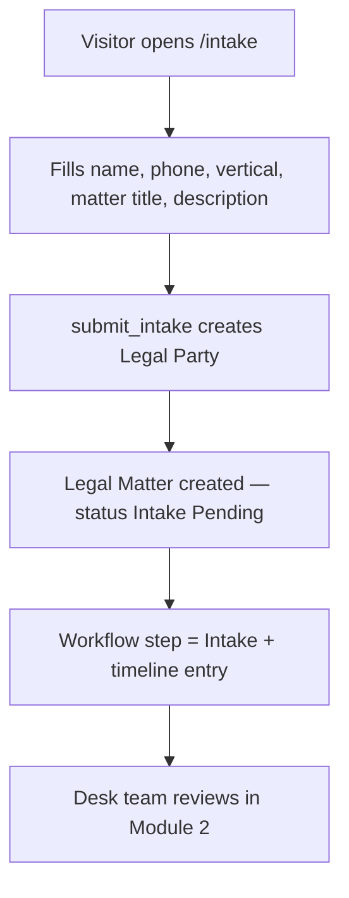
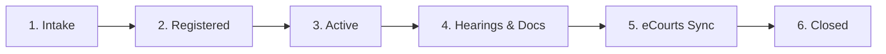
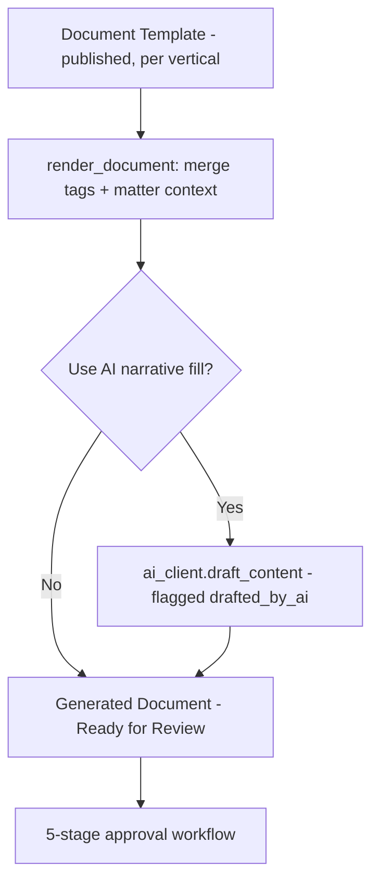
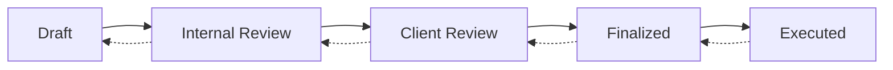

# ⚖️ Chamber — Standard Operating Procedure (SOP)
### Unified Functional Guide for Indian Legal Practice Management

---

> **Document Version:** 2.0 (Unified Release)
> **Application:** Chamber — Frappe v15 / ERPNext v15 Legal Practice Suite
> **Audience:** Chamber Managers, Advocates, Filing Clerks, Intake Desk Staff & Firm Administrators
> **License:** MIT

---

## 📋 Table of Contents

1. [Getting Started & Administrative Setup](#1-getting-started--administrative-setup)
   - 1.1 [Access the Unified System](#11-access-the-unified-system)
   - 1.2 [Initial Setup (One-Time — Admin Only)](#12-initial-setup-one-time--admin-only)
   - 1.3 [Assign User Roles & Matter-Level Security](#13-assign-user-roles--matter-level-security)
   - 1.4 [Configure Integrations (Chamber Settings)](#14-configure-integrations-chamber-settings)
2. [Module 1 — Client Intake & Matter Registration](#2-module-1--client-intake--matter-registration)
   - 2.1 [SOP — Public Portal Intake (Walk-in / Website Lead)](#21-sop--public-portal-intake-walk-in--website-lead)
   - 2.2 [SOP — Conditional Intake Form (Desk)](#22-sop--conditional-intake-form-desk)
   - 2.3 [SOP — Reviewing & Registering a New Matter](#23-sop--reviewing--registering-a-new-matter)
3. [Module 2 — Matter Lifecycle Workflow (6 Steps)](#3-module-2--matter-lifecycle-workflow-6-steps)
4. [Module 3 — Active Case Management](#4-module-3--active-case-management)
   - 4.1 [SOP — Scheduling a Hearing](#41-sop--scheduling-a-hearing)
   - 4.2 [SOP — Filing a Chamber Application](#42-sop--filing-a-chamber-application)
   - 4.3 [SOP — Caveat, Notices & Mediation Tracking](#43-sop--caveat-notices--mediation-tracking)
5. [Module 4 — Document Drafting & Approval](#5-module-4--document-drafting--approval)
   - 5.1 [SOP — Generating a Document from a Template](#51-sop--generating-a-document-from-a-template)
   - 5.2 [SOP — Document Approval Workflow (5 Stages)](#52-sop--document-approval-workflow-5-stages)
   - 5.3 [SOP — PDF Export, Review Routing & e-Signature](#53-sop--pdf-export-review-routing--e-signature)
6. [Module 5 — eCourts & Portal Sync](#6-module-5--ecourts--portal-sync)
   - 6.1 [SOP — CNR-based eCourts Sync](#61-sop--cnr-based-ecourts-sync)
   - 6.2 [SOP — Extended Sync (Order Sheets / Cause List / Judgments)](#62-sop--extended-sync-order-sheets--cause-list--judgments)
   - 6.3 [SOP — Non-eCourts Portals (IP India / NCLT / RERA)](#63-sop--non-ecourts-portals-ip-india--nclt--rera)
7. [Module 6 — AI Assistance (Neethi AI)](#7-module-6--ai-assistance-neethi-ai)
8. [Module 7 — Timeline, Deadlines, Dashboard & Reports](#8-module-7--timeline-deadlines-dashboard--reports)
9. [Module 8 — Closure, Archive & Legal Hold](#9-module-8--closure-archive--legal-hold)
10. [Combined Operating Checklists (Daily, Weekly, Monthly)](#10-combined-operating-checklists-daily-weekly-monthly)
11. [User Roles & Permissions Matrix](#11-user-roles--permissions-matrix)
12. [Integration Endpoint Contracts](#12-integration-endpoint-contracts)
13. [Frequently Asked Questions (FAQ)](#13-frequently-asked-questions-faq)
14. [Support & Escalation](#14-support--escalation)

---

## 1. Getting Started & Administrative Setup

### 1.1 Access the Unified System

1. Open your browser and navigate to your Frappe site URL.
2. Login with credentials provided by your administrator.
3. On the left sidebar, click the **Chamber** workspace.
4. You will see the workspace with quick shortcuts and module cards:
   - 📁 **Matters** — Legal Matter, Hearing, Chamber Application, Timeline Entry
   - 🧭 **Masters** — Legal Vertical, Matter Type, Legal Party, Court, Clause Library
   - 📝 **Intake & Forms** — Intake Form Template, Intake Submission, Intake Form page
   - 📄 **Documents** — Document Template, Generated Document
   - ☁️ **eCourts & AI** — eCourts Sync Log, Caveat, Notice, Mediation Session, Signature Request
   - 📊 **Pages** — Chamber Dashboard, Deadline Tracker, Matter Timeline
   - 📈 **Reports** — Upcoming Hearings, Court Fees, Matter Status, Deadline Watch

**Public (no-login) portal pages:**

| Page | URL | Purpose |
|---|---|---|
| Home | `/index` | Firm landing page with practice verticals |
| Intake | `/intake` | Client-facing intake form → creates a matter |
| Case Status | `/case-status` | Client searches own case by title / case no. / CNR |
| Workflow | `/workflow` | Case workflow visualization |

---

### 1.2 Initial Setup (One-Time — Admin Only)

> **Who does this:** System Administrator
> **Purpose:** Install the app and seed the foundational masters so the platform is operational.

```bash
cd frappe-bench
bench get-app https://github.com/Naveenkumar-S007/Chamber.git
bench --site your-site install-app chamber
bench --site your-site migrate
bench build --app chamber
```

On install / migrate (`chamber/setup/install.py`) the system automatically:

| Step | Action | Where it lands |
|---|---|---|
| 1 | Creates roles: **Chamber Manager**, **Advocate**, **Filing Clerk** | Desk → Users & Roles |
| 2 | Creates matching **Role Profiles** (one-click user assignment) | Desk → Role Profile |
| 3 | Seeds **7 Legal Verticals** + ~60 **Matter Types** with milestone sequences | Masters |
| 4 | Creates the **Chamber Workspace** (sidebar, cards, shortcuts) | Workspace |
| 5 | Sets **Chamber Settings** defaults (eCourts URL, reminder days, AI tokens) | Chamber Settings |
| 6 | Creates realistic **sample data** (courts, parties, matters, hearings) | Demo records |

> [!TIP]
> All vertical configuration (milestones, intake fields, template lists) is **data** in `chamber/setup/seed.py`, editable in Desk — new verticals need **no code**.

The app runs **standalone on Frappe v15** and **couples with ERPNext v15** (Legal Parties mirror Customers/Contacts; hooks are guarded — no ERPNext, no problem).

---

### 1.3 Assign User Roles & Matter-Level Security

> **Who does this:** Administrator

Go to **Desk → Users**, select the employee, and set the Role Profile:

| Role Profile | Roles included | Typical user |
|---|---|---|
| **Chamber Manager** | Chamber Manager + Advocate + Filing Clerk | Firm partner / office head |
| **Advocate** | Advocate | Practicing lawyer |
| **Filing Clerk** | Filing Clerk | Registry / clerical staff |

> [!IMPORTANT]
> **Matter-level isolation (opt-in):** enable **Enforce Matter-Level Permissions** in Chamber Settings. Advocates then see only matters **assigned to them** (assigned_advocate) or **explicitly shared** (DocShare). Managers always see everything.
> Enforced via `get_permission_query_conditions` / `has_permission` hooks on `Legal Matter` and `Chamber Application`.

---

### 1.4 Configure Integrations (Chamber Settings)

> **Who:** Administrator
> **Where:** Desk → **Chamber Settings**

| Section | Fields | Notes |
|---|---|---|
| **eCourts** | Enable sync, **App Code**, API URL | App Code from [services.ecourts.gov.in](https://services.ecourts.gov.in). Without it, sync fails gracefully → manual entry. Optional **Order Sheet / Cause List / Judgments URLs** enable extended fetches. |
| **E-signature** | Enable, provider, API URL / key / callback secret | Webhook receiver: `POST {site}/api/method/chamber.api.esign.receive_webhook` |
| **AI** | Enable, API URL / key / model | Any **OpenAI-compatible** endpoint (OpenAI, DeepSeek, Ollama, vLLM…) |
| **Portal sync** | Enable, per-portal endpoint overrides | IP India / NCLT / State RERA |
| **Push webhook** | **Webhook Secret** | Courts/portals push case updates to your site |
| **Security** | Enforce Matter-Level Permissions | See §1.3 |
| **Reminders** | Default reminder days, recipient role | Daily hearing-reminder email + `.ics` invite |

**Verify before going live** — buttons on Chamber Settings:
- **Test Connections** — config + reachability of eCourts / e-sign / AI / portals
- **Test eCourts Lookup (Live)** — real CNR status call (read-only)
- **Test Portal (Dry-run)** — connector fetch + parse, zero writes

---

## 2. Module 1 — Client Intake & Matter Registration

> **Purpose:** Capture a new client (walk-in or website visitor) and convert them into a structured, vertically-routed Legal Matter.

### 2.1 SOP — Public Portal Intake (Walk-in / Website Lead)

**Who:** Any visitor (no login) / Front-desk staff
**When:** First client contact



1. Visitor opens **`/intake`** and selects a practice **vertical** (7 seeded verticals shown by priority).
2. They fill client name, phone, vertical, matter title and description (FIR / CNR numbers optional).
3. Submit calls `chamber.www.intake.submit_intake`, which:
   - Creates the **Legal Party** (Client, is_client=1) — or reuses an existing match by name/email/phone.
   - Creates the **Legal Matter** with `status = Intake Pending`, the vertical's default Matter Type, and the client linked in the parties table.
4. ✅ **Expected Result:** Matter appears in the desk under **Intake Pending** with workflow step **Intake**.

> [!CAUTION]
> This endpoint is currently guest-accessible. For production, restrict it (captcha / rate-limit / login) — see FAQ Q6.

### 2.2 SOP — Conditional Intake Form (Desk)

**Who:** Intake desk staff / Advocate
**When:** Detailed intake for an existing or new matter

1. Open **Intake Form** page (`/app/intake-form`) from the workspace card.
2. Select the **Legal Matter** and an **Intake Form Template** (published, per vertical).
3. The form renders the **universal Client Details base section** + the vertical's conditional fields; sub-answers branch further (e.g. *"Are you complainant or accused?"* → bail/custody fields).
4. Submit → `chamber.api.intake.submit` creates an **Intake Submission** with all responses.
5. ✅ **Expected Result:** Responses are copied onto matching Legal Matter fields, and the client **Legal Party** is auto-created/updated from the base section (`apply_client_base_fields`).

### 2.3 SOP — Reviewing & Registering a New Matter

**Who:** Advocate / Chamber Manager
**When:** After intake submission lands

1. Open the matter from the **Legal Matter** list (filter: Status = Intake Pending).
2. Verify **Vertical** and **Matter Type** match (the system validates the pair — a type from another vertical is rejected on save).
3. On save, the system **auto-computes**:
   - **Limitation expiry** — `cause_of_action_date + limitation_years`, flagged red when expired (`compute_limitation`).
   - **Portal auto-route** — IP/Trademark/Patent → *IP India*; IBC/Insolvency → *NCLT / NCLAT*; RERA/real-estate → *State RERA* (`auto_route`).
   - **Routing tier** — DV → Magistrate Court; anticipatory bail / quashing / appeal → High Court; consumer → Consumer Forum; MACT → MACT Tribunal; family → Family Court.
   - **eCourts coverage** — live-sync vs manual-fallback hint shown on the form (`compute_ecourts_coverage`).
4. Attach parties (client, opposing, witnesses) in the **parties child table** — the Client link syncs automatically.
5. ✅ **Expected Result:** Matter is ready for the lifecycle workflow (Module 2).

---

## 3. Module 2 — Matter Lifecycle Workflow (6 Steps)

> **Purpose:** A guided, visual lifecycle so every file follows the same path. Rendered as a **progress bar** with a contextual **Workflow → Next Step** button on every Legal Matter.



| Step | Button label | What happens | Status mapping |
|---|---|---|---|
| 1. **Intake** | *Register Matter* | Team reviews intake; vertical/type confirmed | Intake Pending |
| 2. **Registered** | *Activate Matter* | Matter fully set up (court, client, parties) | Intake Pending |
| 3. **Active** | *Go to Hearings & Docs* | Working begins — tracking, deadlines | Active |
| 4. **Hearings & Docs** | *Configure eCourts Sync* | Hearings scheduled, documents drafted | Active |
| 5. **eCourts Sync** | *Close Matter* | Portal sync configured and running | Active |
| 6. **Closed** | — | Disposed / settled / withdrawn | Closed |

**How to advance:** open a Legal Matter → the colored progress bar shows the current step → click **Workflow → {Next Step}** → a guided dialog collects step-specific details (e.g. court/judge for *Activate*, CNR for *eCourts Sync*) → `advance_workflow(target_step)` runs.

✅ **Expected Result per advance:**
- `workflow_step` moves **forward only** (backward moves are blocked by validation).
- `status` is re-mapped automatically (see table).
- A **Timeline Entry** milestone is logged (`Workflow → {step}`).
- The progress bar re-renders with completed steps ticked green.

> [!WARNING]
> Known divergence: setting Status directly to *Disposed/Withdrawn/Closed* (without the Close dialog) does **not** move `workflow_step` to Closed — the bar and status can disagree. Always close via the **Workflow → Close Matter** button.

---

## 4. Module 3 — Active Case Management

> **Purpose:** Everything happening *inside* an active matter — hearings, applications, caveats, notices and mediation — all feeding the matter timeline automatically.

### 4.1 SOP — Scheduling a Hearing

**Who:** Advocate / Filing Clerk
**When:** On listing, and after each hearing date

1. Open the matter → **Hearing** (or Desk → Hearings → + New).
2. Select the **Legal Matter**, set **Hearing Date**, **Purpose**, **Judge**.
3. After the hearing: record **Outcome** and set **Next Hearing Date**.
4. Click **Save** — `hearing.on_update` posts a **Hearing** event to the matter timeline.

✅ **Expected Result:** The matter's *next hearing date* and the **Matter Timeline** page update automatically.

### 4.2 SOP — Filing a Chamber Application

**Who:** Advocate
**When:** Any interlocutory filing — bail, injunction, discovery, transfer petition…

1. Desk → **Chamber Application** → + New.
2. Enter **Application Title**, link the **Matter**, choose **Application Type** (Bail, Interim Injunction / Stay, Discovery…) and **Governing Legal Provision** (e.g. *Section 438, CrPC*).
3. Fill court/bench/judge, filing date, urgency (Normal / Urgent / Ex-parte) and court fees.
4. Track status through its lifecycle: **Draft → Filed → Listed → Heard → Order Passed → Disposed/Withdrawn**.
5. Use the **Hearing Log** child table for multiple chamber dates — the header *next hearing date* syncs to the latest log row.
6. Click **Save**.

✅ **Expected Result:** Client auto-filled from the matter; timeline entry on filing.

> [!TIP]
> **Automatic hearing reminders:** a daily scheduler job (`send_hearing_reminders`) emails the assigned advocate (with an **.ics calendar invite** attached) and posts an in-desk notification before every upcoming chamber hearing (default 3 days — configurable per application and in Chamber Settings).

### 4.3 SOP — Caveat, Notices & Mediation Tracking

| Doctype | SOP | Automation |
|---|---|---|
| **Caveat** | File with caveat number, court, client; validity auto-set (90 days, Sec. 148A CPC) | Daily job `expire_overdue_caveats` flags expiry + reminder; expiry band on timeline |
| **Notice** | Record legal/demand notices — type, recipient, issued/served dates, status | Timeline event on save |
| **Mediation Session** | Log each session — date, purpose, outcome, next session date | Each session = distinct timeline marker |
| **Document Collection** | Track expected documents (property matters are document-blocked) | Parallel track on Matter Timeline |

---

## 5. Module 4 — Document Drafting & Approval

> **Purpose:** From reusable templates to signed, executed documents — with a validated approval workflow and mandatory lawyer review for sensitive/AI-drafted content.

### 5.1 SOP — Generating a Document from a Template

**Who:** Advocate / Paralegal
**When:** Any filing, notice or contract needed



1. Open the matter → **Generate Document** → pick a **Document Template** (same vertical, status *Published*).
2. The merge engine (`utils/merge_engine.py`) renders `{{ client_name }}`, `{{ fir_number }}`, `{{ next_hearing_date }}`… from matter data, parties, hearings and intake responses.
3. Optionally tick **Use AI** for narrative drafting — the result is flagged `drafted_by_ai` and **requires lawyer review**.
4. Templates uploaded via **Import from File** (`.docx`/`.txt`/`.pdf`) get their merge tags extracted for mapping — no engineering release needed.
5. ✅ **Expected Result:** A **Generated Document** in status *Ready for Review*, plus a Document timeline entry.

### 5.2 SOP — Document Approval Workflow (5 Stages)

**Who:** Drafting advocate → reviewing lawyer → client → partner
**Where:** Generated Document → **Workflow** buttons



1. **Draft** → *Internal Review*: internal counsel checks the draft.
2. **Internal Review** → *Client Review*: client approves the text.
3. **Client Review** → *Finalized*: locked for filing/signing.
4. **Finalized** → *Executed*: filed or signed; final timeline entry logged.

Rules enforced by `validate_workflow_transition`:
- Only **adjacent transitions** (with one-step back) are allowed — jumps throw a validation error.
- **Sensitive templates** (DV / 498A / adoption, or AI-drafted) **cannot pass Internal Review** without `reviewed_by` set — mandatory lawyer review.
- **Executed** documents can be stepped back to *Finalized* only.

> [!TIP]
> Use **Suggest Clauses** on a Generated Document to pull relevant boilerplate from the **Clause Library** — matched by drafting type (Litigation vs Transactional) and overlapping tags.

### 5.3 SOP — PDF Export, Review Routing & e-Signature

**Who:** Advocate / Chamber Manager
**When:** Document is finalized

1. **Generate PDF** — renders the document to PDF and attaches it as a **private File** on the record (`chamber.api.documents.generate_pdf`).
2. **Send for Review** — creates **ToDo** assignments for chosen reviewers; status → *Under Review* (`send_for_review`).
3. **Send for Signature** — `chamber.api.esign.send_for_signature` creates a **Signature Request**, sends it to the provider (DocuSign / Dropbox Sign / SignDesk / eMudhra / any REST signing API) and returns an embeddable signing link.
4. The provider calls back `POST /api/method/chamber.api.esign.receive_webhook` → status flows **Sent → Viewed → Signed / Declined / Expired** → timeline entry.

✅ **Expected Result:** Executed, signed PDF archived against the matter with a full audit trail.

---

## 6. Module 5 — eCourts & Portal Sync

> **Purpose:** Keep case stage, hearings and orders current from government portals — with honest fallback where coverage doesn't exist.

### 6.1 SOP — CNR-based eCourts Sync

**Who:** Advocate / Filing Clerk
**When:** After registration, then continuously

1. On the matter, enter the **CNR Number** and tick **Auto-Sync from eCourts**.
2. The **hourly scheduler job** (`poll_auto_sync_matters`) refreshes the CNR status bundle: case stage, judge, next hearing → upserts Hearings and logs to **eCourts Sync Log**.
3. Manual anytime: **Sync from eCourts** button → `chamber.api.ecourts.sync`.
4. Sync **respects the Routing Tier** (§2.3) — a tier mismatch blocks sync with a clear error.
5. ✅ **Expected Result:** Next hearing date, case stage and judge stay live without manual re-entry.

### 6.2 SOP — Extended Sync (Order Sheets / Cause List / Judgments)

> [!IMPORTANT]
> eCourts does **not** publish order-sheet / cause-list / judgment endpoints publicly. These fetches fire only when you configure firm- or vendor-provided endpoint URLs in Chamber Settings (contract shapes in §12).

1. Set **Order Sheet URL / Cause List URL / Judgments URL** in Chamber Settings.
2. On the matter, click **Sync Extended** (`chamber.api.ecourts.sync_extended`).
3. Order-sheet entries post as **Order** timeline events; cause-list listings as **Hearing** events; judgment PDFs are **downloaded and attached** to the matter.
4. Without endpoints, the action reports *not configured* per item — no silent failures.

### 6.3 SOP — Non-eCourts Portals (IP India / NCLT / RERA)

**Who:** Advocate handling IP / insolvency / real-estate files

1. The **Portal** field is auto-suggested from the matter sub-type (§2.3); override freely.
2. Tick **Auto-Sync from Portal** — the hourly job (`poll_portal_matters`) runs the matching connector: `IPIndiaConnector`, `NCLTConnector`, `RERAPortalConnector` (GET→POST, JSON + HTML-table parsing, endpoint overrides).
3. Where no API exists, record status manually via **Update Portal Status** (`update_portal_status`) — the on-form **eCourts Coverage** hint always shows live-sync vs manual fallback honestly.
4. **Appeal chains:** link `parent_matter` — appellate ↔ trial-court CNR relationships stay visible on both timelines (`sync_appellate_chain`).

---

## 7. Module 6 — AI Assistance (Neethi AI)

> **Who:** Advocates with AI enabled in Chamber Settings
> **Purpose:** Vertical-aware drafting and bulk document reading via any OpenAI-compatible endpoint.

| Feature | SOP | Mapping |
|---|---|---|
| **AI Drafting** | On document generation, tick *Use AI* → narrative fill on top of the structured merge | `ai_client.draft_content`, `chamber/api/documents.render_document` |
| **Bulk Upload / Extraction** | Upload an FIR / cheque / agreement file → AI extracts fields (cheque number, sections charged, parties…) → auto-fill matter fields per the vertical's **AI Extraction Field** map | `chamber/api/ai.py`, `Legal Vertical.ai_extraction_fields` |
| **Sensitive flag** | DV / 498A / adoption extractions are flagged for **mandatory lawyer review** — never auto-applied without review | `requires_lawyer_review` |

> [!CAUTION]
> Without a configured AI endpoint, AI buttons fail with a connection error — they do **not** silently degrade. Configure or skip AI features.

---

## 8. Module 7 — Timeline, Deadlines, Dashboard & Reports

> **Purpose:** One view of everything, so nothing statutory slips.

### Matter Timeline (page `matter-timeline`)
Chronological, filterable case history auto-populated from hearings, documents, notices, caveats, applications and workflow milestones — with **statutory countdown bands** (Sec. 138 15-day window, limitation period, caveat expiry), vertical milestone paths and the property **document-collection track**. Engine: `chamber/utils/timeline_engine.py`.

### Deadline Tracker (page `deadline-tracker`)
Corporate/IP-style countdown feed: statutory deadlines, limitation expiry, IP renewals and caveat expiry in one filterable list (`chamber/api/deadlines.py`).

### Chamber Dashboard (page `chamber-dashboard`)
Charts (matters by vertical/status, hearings in next 30 days) + headline counters (court fees, pending signatures, active caveats, flagged deadlines) (`chamber/api/dashboard.py`).

### Standard Reports

| Report | Focus | Primary filters |
|---|---|---|
| **Upcoming Hearings** | Next hearing dates across the firm | Date range, advocate |
| **Matter Status** | Case load by vertical / status | Vertical, status |
| **Deadline Watch** | Everything expiring soon | Days window |
| **Court Fees** | Fees paid per matter/application | Date range, court |

---

## 9. Module 8 — Closure, Archive & Legal Hold

> **Who:** Chamber Manager
> **When:** Matter disposed, settled, withdrawn — or needs freezing

1. **Close** via **Workflow → Close Matter** (Module 2) — sets step *Closed* + status and logs the milestone.
2. **Archive Matter** (`archive_matter`) — sets `is_archived` with reason + who/when; grey list indicator; reversible via **Unarchive**.
3. **Legal Hold** (`set_legal_hold`) — red indicator; freezes document deletion/destruction for litigation-preservation duty.
4. ✅ **Expected Result:** Every action leaves a Timeline Entry — full audit trail.

**Client self-service:** clients track progress at **`/case-status`** — searching by matter title, case number or CNR returns status, court, upcoming hearings and recent timeline events.

---

## 10. Combined Operating Checklists (Daily, Weekly, Monthly)

### 10.1 Daily Checklist

| Task | Category | Responsible |
|---|---|---|
| ☐ Review new **Intake Pending** matters from portal + desk intake | Intake | Advocate / Intake desk |
| ☐ Check **Upcoming Hearings** report for today's listings | Hearings | Filing Clerk |
| ☐ Review **Deadline Watch** for items expiring this week | Deadlines | Advocate |
| ☐ Verify hearing reminders went out (email + .ics) | Automation | Chamber Manager |
| ☐ Check eCourts Sync Log for failed polls | Sync | Filing Clerk |

### 10.2 Weekly Operational Review

| Task | Category | Responsible |
|---|---|---|
| ☐ Advance workflow steps stuck at *Registered* / *Active* | Lifecycle | Chamber Manager |
| ☐ Clear documents sitting in *Internal Review* / *Client Review* | Documents | Reviewing lawyer |
| ☐ Run **Sync Extended** on matters with orders/judgments expected | eCourts | Advocate |
| ☐ Review caveats expiring in next 30 days | Caveats | Filing Clerk |
| ☐ Mediation follow-ups (sessions due) | Family matters | Advocate |

### 10.3 Monthly Compliance Audit

| Task | Category | Responsible |
|---|---|---|
| ☐ Audit **Matter Status** report — stale/no-activity matters | Management | Chamber Manager |
| ☐ Review **Court Fees** report vs receipts | Finance | Chamber Manager |
| ☐ Verify limitation-expiry flags cleared or actioned | Compliance | Advocate |
| ☐ Archive closed matters; confirm legal holds still valid | Records | Chamber Manager |
| ☐ Run **Test Connections** on Chamber Settings | IT | Administrator |

---

## 11. User Roles & Permissions Matrix

| Feature / DocType | Chamber Manager | Advocate | Filing Clerk | Guest (portal) |
|---|---|---|---|---|
| **Legal Matter** (create/edit/close) | ✅ | ✅ (own*, see §1.3) | ✅ (no delete) | ❌ |
| **Hearing / Timeline Entry** | ✅ | ✅ | ✅ | ❌ |
| **Chamber Application** | ✅ | ✅ (own*) | ✅ (no delete) | ❌ |
| **Document Template** (publish) | ✅ | ✅ (no delete) | 👁 read-only | ❌ |
| **Generated Document** (approve/sign) | ✅ | ✅ | ❌ | ❌ |
| **Chamber Settings / Roles** | ✅ | ❌ | ❌ | ❌ |
| **Archive / Legal Hold** | ✅ | ❌ | ❌ | ❌ |
| **`/intake` portal form** | — | — | — | ✅ |
| **`/case-status` search** | — | — | — | ✅ |

*Legend: ✅ Full Write/Submit | 👁 Read-Only | ❌ No Access | \* scoped by matter-level permissions when enabled*

---

## 12. Integration Endpoint Contracts

These endpoints are **best-effort configurable hooks** — configure them in Chamber Settings; they only fire when present.

### eCourts extended fetches
- **Order Sheet URL** — GET with `cnr_number` & `app_code`. Expect `{"order_sheets": [{"order_date": "YYYY-MM-DD", "order_text": "..."}]}` → Order timeline events.
- **Cause List URL** — GET with `cnr_number` & `app_code`. Expect `{"cause_list": [{"listing_date": "YYYY-MM-DD", "purpose": "..."}]}` → Hearing events.
- **Judgments URL** — GET with `cnr_number` & `app_code`. Expect `{"judgments": [{"title": "...", "pdf_url": "https://..."}]}` → PDFs attached to the matter.

### Push webhook (`chamber.api.webhooks.receive_update`)

```bash
curl -X POST https://your-site/api/method/chamber.api.webhooks.receive_update \
  -H "X-Chamber-Secret: <webhook_secret>" \
  -H "Content-Type: application/json" \
  -d '{
    "cnr_number": "KA01-000123-2024",
    "case_status": "Next Hearing Listed",
    "case_stage": "For Arguments",
    "next_hearing_date": "2026-09-01",
    "judge": "Justice A",
    "order_summary": "...",
    "portal": "eCourts"
  }'
```

Updates the matter, upserts a Hearing, posts a timeline entry and logs to the eCourts Sync Log. Wrong/missing secret → 401.

### e-Signature webhook (`chamber.api.esign.receive_webhook`)

`POST {site}/api/method/chamber.api.esign.receive_webhook` with `{request_id, status}` (generic), or Dropbox Sign / DocuSign style payloads. Status map: `signed/completed → Signed`, `sent/delivered → Sent`, `viewed → Viewed`, `declined → Declined`, `voided/expired → Expired`, others → Failed. Verify with `esign_callback_secret`.

---

## 13. Frequently Asked Questions (FAQ)

#### Q1: Why can't I move a matter backwards in the workflow?
**A:** `advance_workflow()` enforces **forward-only** steps to protect the audit trail. If a matter was closed in error, set the status back in Desk and re-advance the steps (a known gap — see Q5).

#### Q2: Why did my document refuse to leave Internal Review?
**A:** The template is **sensitive** (DV / 498A / adoption) or the draft was **AI-generated**. Both flags force mandatory lawyer review — someone must be recorded in `reviewed_by` before the document can advance to Client Review. This is by design.

#### Q3: eCourts sync says "manual entry only" — why?
**A:** The **eCourts Coverage** hint on the matter shows the reason: no CNR number, or the linked Court is flagged as manual-fallback (digitization varies by state/tier). Add the CNR or pick an `ecourts_enabled` court; otherwise enter hearings manually.

#### Q4: How do reminders work?
**A:** A daily job emails the assigned advocate before upcoming chamber hearings (default 3 days) with an `.ics` calendar invite attached, and posts an in-desk notification. Caveat expiry reminders work the same way. Configure lead time in Chamber Settings or per application.

#### Q5: I set Status = Disposed but the progress bar still shows an earlier step.
**A:** Status and `workflow_step` are independent fields; only the **Workflow → Close Matter** button moves both together. Prefer the button (known divergence, planned fix).

#### Q6: Is the public intake form safe from spam?
**A:** `/intake` is currently guest-accessible and creates real records. For production, front it with a captcha/rate limiter or require login — see the repository issues for the planned hardening.

#### Q7: Can I add my own practice area?
**A:** Yes — verticals, matter types, intake fields, milestone sequences and template lists are all **data** (Desk-editable; seeded from `chamber/setup/seed.py`). The engines are vertical-agnostic: "build once, configure per vertical."

#### Q8: Does this need ERPNext?
**A:** No. Chamber runs **standalone on Frappe v15**. If ERPNext is installed, Legal Parties optionally mirror Customer/Contact records — all hooks are guarded.

---

## 14. Support & Escalation

For technical issues, integration credentials, or bugs:

- 🐛 **Issues:** [github.com/Naveenkumar-S007/Chamber/issues](https://github.com/Naveenkumar-S007/Chamber/issues)
- 🧪 **Tests:** `python -m unittest discover -s chamber/tests -t . -v` (no bench needed) · `bench --site <site> run-tests --app chamber`
- 🔄 **CI:** GitHub Actions runs the unit test suite on every push (`.github/workflows/ci.yml`)
- 🌐 **Demo data:** `bench --site <site> execute chamber.setup.demo.run`

---

*End of Chamber Standard Operating Procedure (SOP)*
